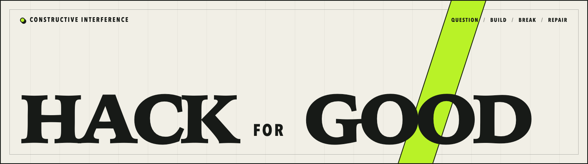

  

Professionally curious about unintended behavior and solving complex problems through engineering.

I mostly play around with supply chain security, CI/CD security, and static analysis. Sometimes I contribute to open source.

